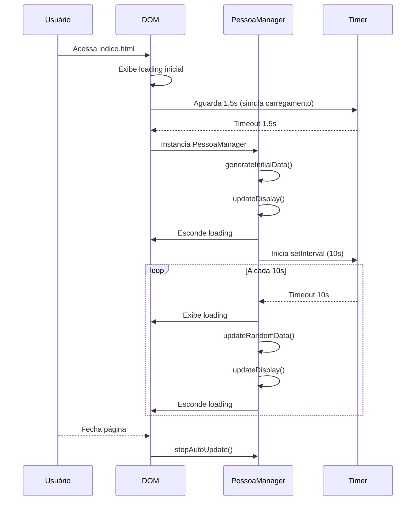

# Diagrama de Sequência - Página de Pesquisa de Pessoas

---

**Legenda:**
- `PessoaManager` é a classe JS que gerencia os dados mockados e atualizações.
- O DOM exibe/atualiza a interface conforme os dados mudam.
- O Timer representa os delays simulando chamadas de API e o intervalo de atualização automática.
